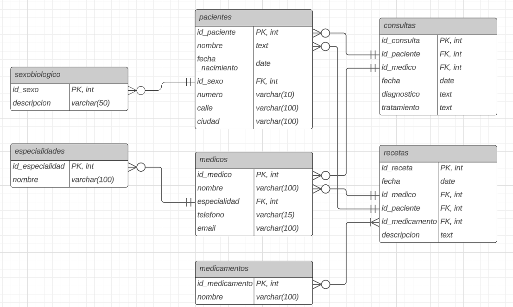

Trabajo Práctico N°5
BBDD, SQL y Manejo de Versiones

Fecha de entrega: Miércoles 05 de Junio 2024

Informática Médica 2024
Prof. Carlos Lazzarino
Ingrid Celia Spessotti
Eugenia Camila Berrino
Aylin Agatha Vázquez Chenlo

Autores:
Mateo Lopez Gaffney - 61845
Martina Nudelman - 62586

PARTE 1: Bases de Datos
1. ¿Qué tipo de base de datos es?
rta

2. Armar el diagrama de entidad relación.

3. Considera que la base de datos está normalizada. En caso que no lo esté, ¿cómo podría hacerlo?
rta

PARTE 2: Bases de Datos
1. Obtener el nombre y la dirección de los pacientes que viven en Buenos Aires.

