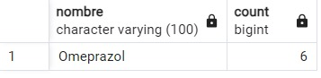

# Trabajo Práctico N°5
## BBDD, SQL y Manejo de Versiones

### Fecha de entrega: Miércoles 05 de Junio 2024
### Informática Médica 2024
* Prof. Carlos Lazzarino
* Ingrid Celia Spessotti
* Eugenia Camila Berrino
* Aylin Agatha Vázquez Chenlo


### Autores:
* Mateo Lopez Gaffney - 61845
* Martina Nudelman - 62586

## PARTE 1: Bases de Datos
### 1. ¿Qué tipo de base de datos es?
rta

### 2. Armar el diagrama de entidad relación.


### 3. Considera que la base de datos está normalizada. En caso que no lo esté, ¿cómo podría hacerlo?
rta

## PARTE 2: Bases de Datos

### 1. Obtener el nombre y la dirección de los pacientes que viven en Buenos Aires.

```
select nombre, numero, calle from pacientes where ciudad='Buenos Aires' 

```


### 2. Obtener la cantidad de recetas emitidas por cada médico.

```
SELECT m.nombre, COUNT(*) AS recuento_recetas
FROM medicos m
INNER JOIN recetas r ON m.id_medico = r.id_medico
GROUP BY m.nombre
ORDER BY recuento_recetas DESC;

```


### 3. Obtener el nombre de los pacientes junto con la fecha y el diagnóstico de todas las consultas médicas realizadas en junio del 2024.

```
SELECT p.nombre, c.fecha, c.diagnostico
from pacientes p, consultas c
where c.fecha between '01-06-2024' and '30-06-2024'
and p.id_paciente=c.id_paciente
order by c.fecha

```


### 4. Obtener el nombre de los medicamentos prescritos más de una vez por el médico con ID igual a 2.

```
select nombre
from medicamentos, recetas
where recetas.id_medico=2 and 
	  recetas.id_medicamento=medicamentos.id_medicamento
group by nombre
having count(*)>1

```


### 5. Obtener el nombre de los pacientes junto con la cantidad total de recetas que han recibido.

```
SELECT p.nombre, count(*)
from pacientes p, recetas r
where p.id_paciente=r.id_paciente
group by p.nombre

```


### 6.Obtener el nombre del medicamento más recetado junto con la cantidad de recetas emitidas para ese medicamento.

```
SELECT m.nombre, count(*)
from medicamentos m, recetas r
where m.id_medicamento=r.id_medicamento
group by m.nombre
order by count(*) desc
limit 1;

```


### 7. Obtener el nombre del paciente junto con la fecha de su última consulta y el diagnóstico asociado.

```
SELECT p.nombre, c.diagnostico, c.fecha
from pacientes p
join consultas c on p.id_paciente=c.id_paciente
WHERE 
    c.fecha = (
        SELECT 
            MAX(c.fecha)
        FROM 
            consultas c
        WHERE 
            c.id_paciente = p.id_paciente
    );
    
```


### 8. Obtener el nombre del médico junto con el nombre del paciente y el número total de consultas realizadas por cada médico para cada paciente, ordenado por médico y paciente.

```
select m.nombre, p.nombre, count(*)
from pacientes p, medicos m, consultas c
where p.id_paciente=c.id_paciente and m.id_medico=c.id_medico
group by m.nombre, p.nombre
order by m.nombre

```


### 9.Obtener el nombre del medicamento junto con el total de recetas prescritas para ese medicamento, el nombre del médico que lo recetó y el nombre del paciente al que se le recetó, ordenado por total de recetas en orden descendente.

```
SELECT 
    m.nombre AS nombre_medicamento,
    COUNT(r.id_receta) AS total_recetas,
    d.nombre AS nombre_medico,
    p.nombre AS nombre_paciente
FROM 
    recetas r
JOIN 
    medicamentos m ON r.id_medicamento = m.id_medicamento
JOIN 
    medicos d ON r.id_medico = d.id_medico
JOIN 
    pacientes p ON r.id_paciente = p.id_paciente
GROUP BY 
    m.nombre, d.nombre, p.nombre
ORDER BY 
    total_recetas DESC;

```


### 10.Obtener el nombre del médico junto con el total de pacientes a los que ha atendido, ordenado por el total de pacientes en orden descendente.

```
SELECT 
    d.nombre AS nombre_medico,
    COUNT(DISTINCT c.id_paciente) AS total_pacientes
FROM 
    consultas c
JOIN 
    medicos d ON c.id_medico = d.id_medico
GROUP BY 
    d.nombre
ORDER BY 
    total_pacientes DESC;


```

